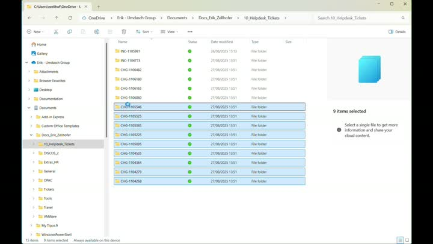
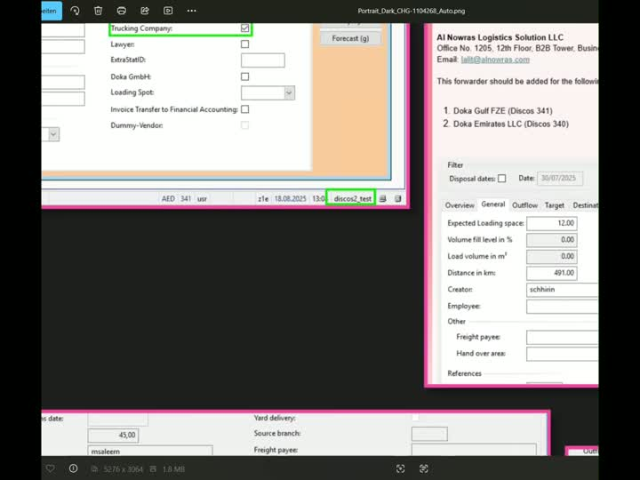

#  Doka Screenshot Tool

<div align="center">

```PowerShell
+ ╔════════════════════════════════════════════════════════════════════════╗
+ ║                                                                        ║
+ ║ ...................................................................... ║
+ ║ ...................................................................... ║
+ ║ .....@@@@@@@@@@...............@@..............@@...................... ║
+ ║ ....@@..@@.....@.............@@@.............@@@...................... ║
+ ║ ....@@@@@@@@@..@......@@@@@@@@@@..@@@@@@@@@.@@@...@@@@..@@@@@@@@...... ║
+ ║ ....@@@@@@@@@@.@....@@@@@@@@@@@@@@@@@@@@@@@@@@@@@@@@..@@@@@@@@@@@@.... ║
+ ║ ....@@.@@@@@@@@@...@@@......@@@@@@@.....@@@@@@@@@@...@@@......@@@..... ║
+ ║ ....@@@@@@@@@@@@...@@@@@@@@@@@@@@@@@@@@@@@@@@@.@@@@@.@@@@@@@@.@@@..... ║
+ ║ .....@@@@@@@@@@@....@@@@@@@@....@@@@@@@@...@@@...@@@@.@@@@@...@@...... ║
+ ║ ...................................................................... ║
+ ║ ...................................................................... ║
+ ║                                                                        ║
+ ╚════════════════════════════════════════════════════════════════════════╝
```

</div>

<div align="center">


[](https://docs.microsoft.com/en-us/powershell/)
[](https://imagemagick.org/)
</div>

## ✨ Features

- 🎉 **No Windows Admin User needed** - Just execute as plain old **USER**
- 💎 **Automated Setup & Installation** - Complete one-command setup with optional context menu integration
- 💎 **Windows Context Menu Integration** (Optional) - Use the Script via Right Click on Folder **[See Video](#windows-context-menu)**
- 🔩 **Parallel Execution** - Make Countless Montages at the same time in Seconds **[See Video](#parallel-execution)**
- ⚙️ **Zero-Config Installation** - Auto Downloads & installs portable ImageMagick to LocalAppData
- 📸 **Unlimited Folders** - Process any number of PNG files in any Number of Folders
- 🤖 **Smart Auto-Detection** - Automatically analyzes your images
- 🎨 **Intelligent Theming** - Auto Dark/Light mode Background based on average brightness
- 📐 **Optimal Layouts** - Auto Portrait/Widescreen based on quantity & dimensions
- ⚡ **Perfect Grids** - Calculates best column/row arrangements
- 🎯 **Clean Output** - High-Quality Screenshot-Montages with colored Borders and high Resolution **[See Video](#clean-output--zoom)**
- 🎯 **Portable & Self-Contained** - No system-wide installs, everything in user space
- 🔧 **Smart Asset Management** - Auto-downloads latest ImageMagick with version detection
- 📋 **Dynamic Registry Files** - Generates personalized Windows context menu files during setup

## 🎯 Auto Mode Intelligence

- **🔍 Brightness Analysis** - Scans average pixel brightness
- **📐 Dimension Detection** - Analyzes aspect ratios and image sizes
- **📊 Smart Decisions** - Analysis-based decisions for which Grid to use

## 🔞 Disclaimer 
- I am **not responsible** for **deleted Screenshots, still open Helpdesk-Tickets, thermonuclear war 💣**, or you getting **fired** because your alarm app failed. **Please read the [📋Script](Doka-ScreenShotTool.ps1) before Execution!**

-----

# 🚀 Quick Start

## 🎯 One-Command Setup (Recommended)

```powershell
# Complete setup with optional context menu integration
.\Doka-ScreenShotTool.ps1 -setup

# The setup will:
# ✅ Download & install portable ImageMagick
# ✅ Create scmontage command alias  
# ✅ Generate personalized registry files
# ✅ Ask if you want Windows context menu integration (Y/n)
```

## 💎 Usage with Windows Context Menu Integration:

- **Select as many Folders as you want**
- **Rightclick**
- Click **Doka-ScreenShotTool (Auto)** **[See Video](#windows-context-menu-integration)**

## 🛸 Useage without Context Menu Integration:
```powershell
# After setup, use from anywhere:
scmontage -a .\screenshot-folder\

# Or direct script execution:
.\Doka-ScreenShotTool.ps1 -a .\screenshot-folder\
```

### 📋 Flags / Command Options

| Option | Description | Example |
|--------|-------------|---------|
| `-setup` | ⚙️ **Complete Setup** - Install ImageMagick, create registry files, optional context menu | `-setup` |
| `-a` | 🤖 **Auto Mode** - Smart detection **(Recommended)** | `-a .\screenshot-folder\` |
| `-t` | 🧪 **Test Mode** - Creates all 8 combinations (Portrait/Widescreen/Stack/Carousel x Dark/Light) | `-t .\screenshot-folder\` |
| `-p` | 📱 **Portrait** - Vertical layout | `-p -d .\screenshot-folder\` |
| `-w` | 🖥️ **Widescreen** - Horizontal layout | `-w -l .\screenshot-folder\` |
| `-s` | 🏢 **Stack Mode** - Stacks all PNGs vertically in a single column | `-s .\screenshot-folder\` |
| `-c` | 🖼️ **Carousel Mode** - Arranges all PNGs horizontally in a single row | `-c .\screenshot-folder\` |
| `-d` | 🌙 **Dark Theme** - Dark background & pink borders | `-p -d .\screenshot-folder\` |
| `-l` | ☀️ **Light Theme** - Light background & purple borders | `-w -l .\screenshot-folder\` |

## 🎯 Setup Features

- **🏠 LocalAppData Installation** - No admin rights required, installed to `%LOCALAPPDATA%\Doka-ScreenShotTool`
- **🔗 Global Access** - Creates `scmontage` command available from any directory
- **📋 Dynamic Registry Files** - Generates personalized context menu files for your system
- **🎨 ASCII Art Branding** - Beautiful terminal output with DOKA logo and colored borders
- **🔄 Version Management** - Automatic ImageMagick version detection and updates

## 📁 Output Files

- `Portrait_Dark_ScreenshotFolderName_Auto.png`
- `Portrait_Light_ScreenshotFolderName.png` 
- `Widescreen_Dark_ScreenshotFolderName.png`
- `Widescreen_Light_ScreenshotFolderName.png`

## 🔧 Installation Details

After running `-setup`, the following files are created:

**📍 In `%LOCALAPPDATA%\Doka-ScreenShotTool\`:**
- `Doka-ScreenShotTool.ps1` - Main script
- `scmontage.cmd` - Global command shim
- `Doka.ico` - Context menu icon
- `doka_ascii.txt` - ASCII art for branding
- `Install_Context_Menu.reg` - Context menu installer
- `Uninstall_Context_Menu.reg` - Context menu remover

**📍 In script directory:**
- `Install_Context_Menu.reg` - Copy for easy access
- `Uninstall_Context_Menu.reg` - Copy for easy access

**🌐 Environment:**
- `scmontage` command available globally
- `SCMONTAGE` environment variable set
- User PATH updated with tool directory

-----

# 💡Guides & Help

## 💎 Windows Context Menu:

<a href="/assets/video/doc_context.mp4">
  
</a>


**🆕 Automated Installation:**
- Run `.\Doka-ScreenShotTool.ps1 -setup`
- When prompted "Install Windows Context Menu Integration? (Y/n)", press Enter or type Y
- UAC prompt will appear - Enter Password for your User

---

## 🔩 Parallel Execution:

<a href="/assets/video/doc_parallel.mp4">
  
</a>

- **Process multiple** screenshot folders simultaneously for **maximum efficiency.**

---

## 🎯 Clean Output & Zoom:

<a href="/assets/video/doc_zoom.mp4">
  
</a>

- Explore the **High-Quality** output and **Zoom functionality** of the generated montages.

---

# 🧭 Roadmap

- Make **MAYBE** a [DISCOSII]() **Wizard/Masks/Buttons** Database (Mindmap)

-----

[](https://github.com/Ezellhof)

</div>

- *Coding is done 90% by AI so don't tell me any bugs post them in your own ChatGPT and mail me the fixes!*
- *Inspired by the holy Helpdesk 🖥️*
